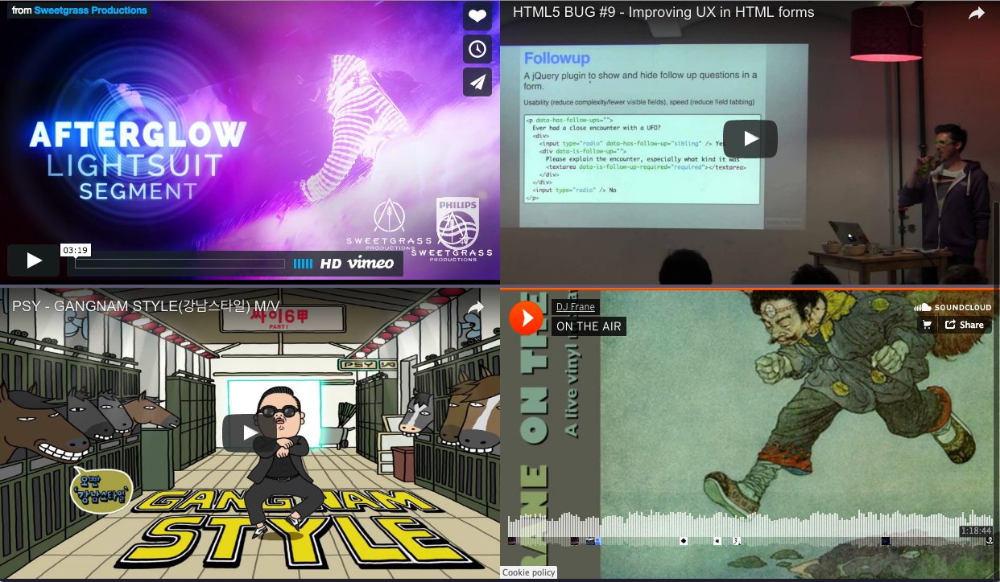

# [multi-video-frames](https://joelpurra.com/projects/multi-video-frames/)

<p class="donate">
    <a href="https://joelpurra.com/donate/proceed/?amount=5&currency=usd"><kbd>Donate $5 now</kbd></a>
    <a href="https://joelpurra.com/donate/proceed/?amount=25&currency=usd"><kbd>Donate $25 now</kbd></a>
    <a href="https://joelpurra.com/donate/proceed/?amount=100&currency=usd&invoice=true"><kbd>Donate $100 now</kbd></a>
    <a href="https://joelpurra.com/donate/"><kbd>More options</kbd></a>
</p>

*Play/view multiple video player streams in the same browser window by using iframes.*

- [Project page and live version](https://joelpurra.com/projects/multi-video-frames/)
- [Example loading four frames](https://joelpurra.com/projects/multi-video-frames/?url=https%3A%2F%2Fplayer.vimeo.com%2Fvideo%2F221449473&url=https%3A%2F%2Fwww.youtube.com%2Fembed%2FXz1a5iTi3aU&url=https%3A%2F%2Fwww.youtube.com%2Fembed%2F9bZkp7q19f0&url=https%3A%2F%2Fw.soundcloud.com%2Fplayer%2F%3Furl%3Dhttps%3A%2F%2Fapi.soundcloud.com%2Ftracks%2F208395706%26visual%3Dtrue)
- [Source code](https://github.com/joelpurra/multi-video-frames/)


## Screenshots

[](https://joelpurra.com/projects/multi-video-frames/?url=https%3A%2F%2Fplayer.vimeo.com%2Fvideo%2F221449473&url=https%3A%2F%2Fwww.youtube.com%2Fembed%2FXz1a5iTi3aU&url=https%3A%2F%2Fwww.youtube.com%2Fembed%2F9bZkp7q19f0&url=https%3A%2F%2Fw.soundcloud.com%2Fplayer%2F%3Furl%3Dhttps%3A%2F%2Fapi.soundcloud.com%2Ftracks%2F208395706%26visual%3Dtrue)  
Screenshot of multi-video-frames in action with sample videos

  
Screenshot of multi-video-frames in action during the 2012 Summer Olympic Games, by Svarten.


## Usage

### Manually enter URLs

1. Go to https://joelpurra.com/projects/multi-video-frames/
1. Click the button to add frame.
1. Enter any URL into the address box.
1. Unfocus the address box (press tab or click outside the box) to load the URL into the frame.
1. Rinse, repeat, enjoy.


### Create a link for sharing

1. Follow the steps for manually entering URLs.
1. Look at the *direct link to these frames* above the videos.
1. Copy the link.
1. Send the link to your friends!


### Sample URLs

- `https://player.vimeo.com/video/221449473`
- `https://www.youtube.com/embed/Xz1a5iTi3aU`
- `https://www.youtube.com/embed/9bZkp7q19f0`
- `https://w.soundcloud.com/player/?url=https%3A//api.soundcloud.com/tracks/208395706&visual=true`


## Common URL fixes

### YouTube

The regular URL will not work ([`X-Frame-Options:SAMEORIGIN`](https://google.com/?q=X-Frame-Options:SAMEORIGIN)) &mdash; but there's a special embed URL that works just fine! Convert the top address to the below adress, by copying the video id. YouTube also has an embed button, as desribed below.

- `https://www.youtube.com/watch?v=VIDEOID`
- `https://www.youtube.com/embed/VIDEOID`

Example

- `https://www.youtube.com/watch?v=oHg5SJYRHA0`
- `https://www.youtube.com/embed/oHg5SJYRHA0`


### Vimeo

Vimeo allows embedding videos, and it's easy to convert from the regular URL to an embeddable version.

- `https://vimeo.com/VIDEOID`
- `https://player.vimeo.com/video/VIDEOID`

Example

- `https://vimeo.com/22439234`
- `https://player.vimeo.com/video/22439234`


### Generic "full screen" video, music, and embeds

If you can find a "share" or "embed" button on your favorite video or music site, there's usually a URL that can be extracted and used as a "full screen"/"full frame" version. The Soundcloud sample URL above was extracted from the embed code for [DJ Frane's track
On The Air](https://soundcloud.com/djfrane/on-the-air) by clicking "share".


## Sharing link URL format

- The base URL is `https://joelpurra.com/projects/multi-video-frames/`.
- The URL lists each video as a [`url` query string key/value](https://url.spec.whatwg.org/#syntax-url-query).
- Each URL query string must be encoded with [`encodeURIComponent(url)`](https://developer.mozilla.org/en-US/docs/Web/JavaScript/Reference/Global_Objects/encodeURIComponent) to ensure query string parameters are passed correctly.
- Each URL has to start with `https://`.
- An example URL with frames with videos from Vimeo and Youtube as well as music from Soundcloud looks like this: [`https://joelpurra.com/projects/multi-video-frames/?url=https%3A%2F%2Fplayer.vimeo.com%2Fvideo%2F221449473&url=https%3A%2F%2Fwww.youtube.com%2Fembed%2FXz1a5iTi3aU&url=https%3A%2F%2Fwww.youtube.com%2Fembed%2F9bZkp7q19f0&url=https%3A%2F%2Fw.soundcloud.com%2Fplayer%2F%3Furl%3Dhttps%3A%2F%2Fapi.soundcloud.com%2Ftracks%2F208395706%26visual%3Dtrue`](https://joelpurra.com/projects/multi-video-frames/?url=https%3A%2F%2Fplayer.vimeo.com%2Fvideo%2F221449473&url=https%3A%2F%2Fwww.youtube.com%2Fembed%2FXz1a5iTi3aU&url=https%3A%2F%2Fwww.youtube.com%2Fembed%2F9bZkp7q19f0&url=https%3A%2F%2Fw.soundcloud.com%2Fplayer%2F%3Furl%3Dhttps%3A%2F%2Fapi.soundcloud.com%2Ftracks%2F208395706%26visual%3Dtrue)


## TODO list

*Patches/pull requests are welcome!*

- Click to close a frame.
- Remember URL history.
- Dynamic frame resize by dragging handles, as it would work in a normal non-browser window.
- Optionally extract the video object (or hide everything else) when loading new URLs, to get a clutter-free view.
- Convert from known URL formats to better URL formats (see YouTube workaround).
- ~~Add dark page background option.~~


## Development

```shell
# Get dependencies.
npm install

# Run tests.
npm run --silent test

# Optionally run a local development server.
npm run --silent start

# Go to the development server's default address.
open "http://localhost:1337"
```


## Thanks

- Thank you [Riley Shaw](https://rileyjshaw.com/) for the icon [*Upper Left*](https://thenounproject.com/term/upper-left/294472/).


---


[multi-video-frames](https://joelpurra.com/projects/multi-video-frames/) Copyright &copy; 2012, 2013, 2014, 2015, 2016, 2017, 2018, 2019, 2020, 2021, [Joel Purra](https://joelpurra.com/). All rights reserved. Released under the [GNU Affero General Public License 3.0 (AGPL-3.0)](https://en.wikipedia.org/wiki/Affero_General_Public_License). [Your donations are appreciated!](https://joelpurra.com/donate/)
